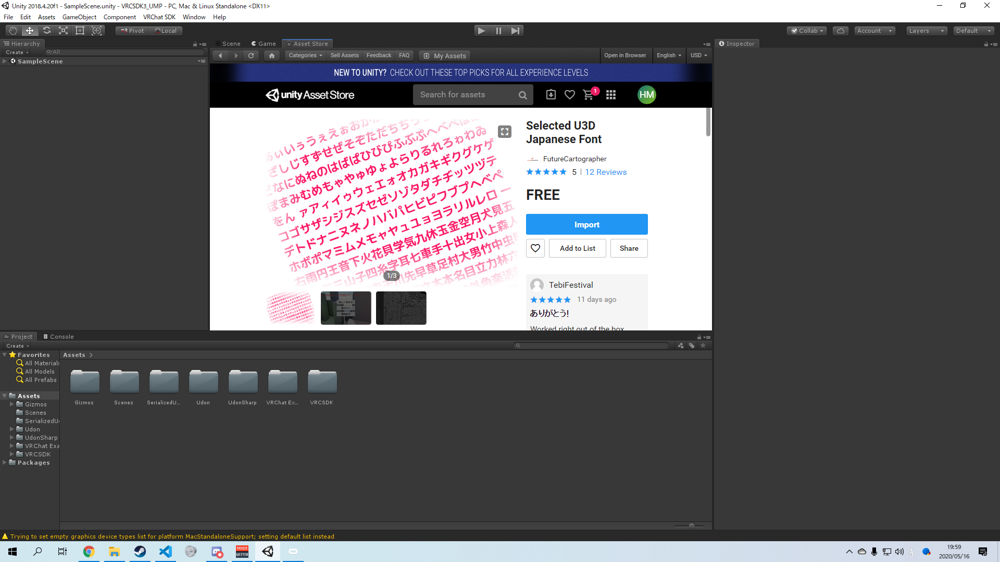

# 導入
## 依存パッケージのインポート

依存パッケージは次の通りです。

- [VRCSDK3 + Udon](https://www.vrchat.com/home/download)
- [Udon Sharp](https://github.com/Merlin-san/UdonSharp/releases/latest)
- TextMeshPro
- [Selected U3D Japanese Font](https://assetstore.unity.com/packages/2d/fonts/selected-u3d-japanese-font-337)

### VRCSDK3
最新のパッケージをダウンロード後、ドラッグ&ドロップでインポートしてください。
### Udon Sharp
最新のパッケージをダウンロード後、ドラッグ&ドロップでインポートしてください。
### TextMeshPro
Unity2018から利用可能なテキスト表示アセットです。Window --> Package Manager --> TextMesh Pro --> Installで導入できます。

### Selected U3D Japanese Font
日本語フォントです。Asset Storeで`Selected U3D Japanese Font`と検索すればHitします。

## UMP本体のインポート
ダウンロードしたUdonMediaPlayerをUnityにインポートしてください。

`UdonMediaPlayer/Prefab/UdonMediaPlayer.prefab`をHierarchyにドラッグ&ドロップしてください。

!!! Tip
    もし、画像のような表示が出た場合、1つ目(上段)のボタンはクリックしてください。2つ目(下段)はサンプルアセットです。導入はおまかせします。
    
    

その後、Hierarchyで任意の`Udon Behaviour`が含まれるオブジェクト(画像はUdonMediaPlayer/PlayerCountController)を選択します。

画面右側、Inspectorの`Udon Behaviour`内、Compile All UdonSharp Programsをクリックしてください。

!!! Tip
    もし、VRCに持ち込んで音楽が再生されない場合、MusicPlayerUIをActive(Inspectorのチェックボックス)にしてからCompile All UdonSharp Programsをしてみてください。
    
    
    それでも動かない場合はご一報ください。[@yukad2](https://twitter.com/yukad2_)

!!! summary
    これで導入は終了です。お疲れ様でした。
